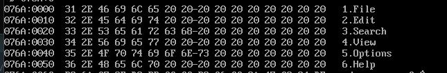
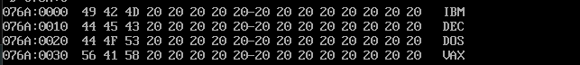
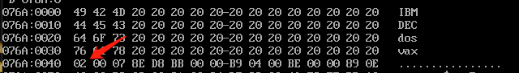
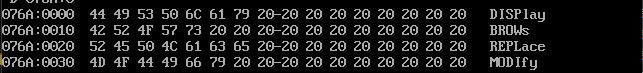
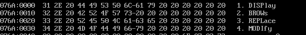
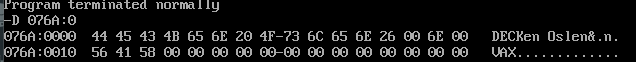

# 第六章 包含多个段的程序

## 6.1 在代码段中使用数据

```
ASSUME CS:CODESG
              DW   0123H,0456H,0789H,0ABCH,0DEFH,0FEDH,0CBAH,0987H       ;DW表示define word 定义字 8*2
       ;将数据定义在代码段中需要移动ip到指定位置后执行 不然会将数据认为代码被执行
              MOV  BX,0
              MOV  AX,0
        
              MOV  CX,8
       S:     ADD  AX,CS:[BX]
              ADD  BX,2
              LOOP S
           
              MOV  AX,4C00H
              INT  21H
           
CODESG ENDS
END

```


代码段开始位置在076A:0000
其中DW写在CODESG中这段数据被认为是代码

 


当使用U命令切换到076A:0010到时候代码变为了正常的代码
在dbg时候可以修改IP=10H 使CS: IP对应程序的第一条指令 然后使用t/p/g命令执行

在需要以当期位置开始的地方设置标号，然后在END后把标号带上就可以使程序从标号开始运行

```
ASSUME CS:CODESG
CODESG SEGMENT
              DW   0123H,0456H,0789H,0ABCH,0DEFH,0FEDH,0CBAH,0987H       ;DW表示define word 定义字 8*2
       ;将数据定义在代码段中需要移动ip到指定位置后执行 不然会将数据认为代码被执行
       start: MOV  BX,0
              MOV  AX,0
        
              MOV  CX,8
       S:     ADD  AX,CS:[BX]
              ADD  BX,2
              LOOP S
           
              MOV  AX,4C00H
              INT  21H
           
CODESG ENDS
END start; 如果将标号可以为任意名字如果设置成s那么就会以s为程序开头

```


在直接使用U命令查看时就到了正确位置

## 6.2 在代码段中使用栈

### 逆序存放     
DW设置情况  
  

在第一次循环结束后


运行结束后


### 监测点6.1

下面的程序一次用内存0:0~0:15单元中的内容改成程序中的数据  
(1)

```
ASSUME CS:CODESG
CODESG SEGMENT
              DW   0123H,0456H,0789H,0ABCH,0DEFH,0FEDH,0CBAH,0987H       ;DW表示define word 定义字 8*2 10

       START: MOV  AX,0
              MOV  DS,AX
              MOV  BX,0
              
              MOV  CX,8

       LOOP1: MOV  AX,[BX]
              MOV  CS:[BX],AX     ;把AX的值写入到DW中                                       ;?????????????????
              
              ADD  BX,2
              LOOP LOOP1

              MOV  AX,4C00H
              INT  21H
           
CODESG ENDS
END  START
```

(2)

```
ASSUME CS:CODESG
CODESG SEGMENT
              DW   0123H,0456H,0789H,0ABCH,0DEFH,0FEDH,0CBAH,0987H                   ;16               ;DW表示define word 定义字 8*2 10
              DW   0000H,0000H,0000H,0000H,0000H,0000H,0000H,0000H,0000H,0000H       ;20字节 10字节作为栈空间
       START: MOV  AX,CS                                                             ;?
              MOV  SS,AX
              MOV  SP,36                                                             ;设置栈顶                                                      ;?

              MOV  AX,0
              MOV  DS,AX                                                             ;这只目标段地址
              MOV  BX,0
              MOV  CX,8

       LOOP1: PUSH [BX]                                                              ;取目标单元中的数据压入栈中
              POP  CS:[BX]                                                           ;????
              ADD  BX,2
              LOOP LOOP1

              MOV  AX,4C00H
              INT  21
           
CODESG ENDS
END  START
```

## 6.3 将数据、代码、栈放入不同的段

<font color="#00ffff">受8086模式限制一个段的大小不允许超过64KB</font>

### 程序6.4

```
ASSUME CS:CODESG, DS:DATASG, SS:STACK
DATASG SEGMENT
              DW 0123H,0456H,0789H,0ABCH,0DEFH,0FEDH,0CBAH,0987H       ;16               ;DW表示define word 定义字 8*2 10
DATASG ENDS
       
STACK SEGMENT
             DW 0,0,0,0,0,0,0,0,0,0,0,0,0,0,0,0
STACK ENDS

CODESG SEGMENT
       START: MOV  AX,STACK        ;栈段位置
              MOV  SS,AX
              MOV  SP,32           ;dw16位写入占位32字节

              MOV  AX,DATASG       ;数据段位置
              MOV  DS,AX

              MOV  BX,0            ;DS:BX指向数据段的第一个单元

              MOV  CX,8
       LOOP1: PUSH [BX]            ;把data段的一个字压入占中
              ADD  BX,2            ;移动地址
              LOOP LOOP1

              MOV  BX,0
              MOV  CX,8
       LOOP2: POP  [BX]            ;弹出栈顶数据到DS:BX的位置 开始为DS:0
              ADD  BX,2
              LOOP LOOP2
       ; 程序结果为镜像排列数据
              MOV  AX,4C00H
              INT  21H
CODESG ENDS
END  START
```

## 实验5 编写、调试具有多个段的程序

```
ASSUME CS:CODE,DS:DATA,SS:STACK
DATA SEGMENT
            DW 0123H,0456H,0789H,0ABCH,0DEFH,0FEDH,0CBAH,0987H
DATA ENDS

STACK SEGMENT
             DW 0,0,0,0,0,0,0,0
STACK ENDS

CODE SEGMENT
       START:MOV  AX,STACK
             MOV  SS,AX
             MOV  SP,16

             MOV  AX,DATA
             MOV  DS,AX

             PUSH DS:[0]
             PUSH DS:[2]

             POP  DS:[2]
             POP  DS:[0]

             MOV  AX,4C00H
             INT  21H
CODE ENDS

END  START

```

<font color="#00ffff">CPU执行程序，程序返回前data段中的数据为多少</font>

<font color="#55ff55">0123H, 0456H, 0789H, 0ABCH, 0DEFH, 0FEDH, 0CBAH, 0987H</font>

CS=076C  
SS=076B  
DS=076A

CODE=X
DATA=X-2
STACK=X-1

```
ASSUME CS:CODE,DS:DATA,SS:STACK
DATA SEGMENT
            DW 0123H,0456H
DATA ENDS

STACK SEGMENT
             DW 0,0
STACK ENDS

CODE SEGMENT
       START:MOV  AX,STACK
             MOV  SS,AX
             MOV  SP,16

             MOV  AX,DATA
             MOV  DS,AX

             PUSH DS:[0]
             PUSH DS:[2]

             POP  DS:[2]
             POP  DS:[0]

             MOV  AX,4C00H
             INT  21H
CODE ENDS

END  START
```

DATA段
32 01 56 04 00 00 00 00 00 00 00 00 00 00 00 00

CS=076C  
SS=076B  
DS=076A

# 第七章 更灵活的定位内存地址的方法

## and指令和or指令

and 指令

```
mov al,01100011B
and al,00111011B

aft>   00100011B
同为1的输出1 有0出0
因此 如果你想控制哪一位输出0只要在那一位标记0其他位都为1即可
and al,00000000B 全部输出0
and al,11111111B 原数据输出
and al,01111111B 把第7位变成0
and al,11111110B 把第0位变成0
```

or 指令

```
mov al,01100011B
or  al,00111011B

aft>   01111011B
有1出1 全0出0
只要标记需要想要改为1的位置就能把那个位置输出1

or  al,11111111B 全部输出1
or  al,00000000B 原数据输出
or  al,10000000B 第七位设置为1
or  al,00000001B 第零位设置为1

```

7.4 大小写转换问题
| 大写 | 十六进制 | 二进制                                | --  | 大写 | 十六进制 | 二进制                                |
| ---- | -------- | ------------------------------------- | --- | ---- | -------- | ------------------------------------- |
| A    | 41       | 01<font color="#00ffff">0</font>00001 | --  | a    | 61       | 01<font color="#00ffff">1</font>00001 |
| B    | 42       | 01<font color="#00ffff">0</font>00010 | --  | b    | 62       | 01<font color="#00ffff">1</font>00010 |
| C    | 43       | 01<font color="#00ffff">0</font>00011 | --  | c    | 62       | 01<font color="#00ffff">1</font>00011 |

从表中可以看出 只需要变化第五位之后即可改变ASCII码的大小写  
<font color="#00FFFF">即：大写字母+20H=小写字母</font>  
<font color="#00FFFF">即：小写字母-20H=大写字母</font>   

```
ASSUME CS:CODE,DS:DATA,SS:STACK
DATA SEGMENT
           DB 'BaSiC'
           DB 'iNfOrMaTiOn'
DATA ENDS

STACK SEGMENT
             
STACK ENDS

CODE SEGMENT
      START:MOV  AX,DATA
            MOV  DS,AX
            MOV  BX,0
          
            MOV  CX,5
      LOOP1:MOV  AL,DS:[BX]
            AND  AL,11011111B      ;把ds转大写
            MOV  DS:[BX],AL
            INC  BX
            LOOP LOOP1
            MOV  CX,11
      LOOP2:
            MOV  AL,DS:[BX]        ; BX寄存器沿用指向下一个information
            OR   AL,00100000B      ; 把字母变成小写
            MOV  DS:[BX],AL
            INC  BX
            LOOP LOOP2

            MOV  AX,4C00H
            INT  21H
CODE ENDS

END  START
```

## 7.5[BX+IDATA]

DS偏移地址加BX后加IDATA  
数学表示 (DS:[BX+AX])=((DS)*16+(BX)+200)

## 7.6 用[BX+IDATA]的方式进行数组的处理

把第一个字符串转为大写第二个字符串转为小写

```
ASSUME CS:CODE,DS:DATA,SS:STACK
DATA SEGMENT
           DB 'BaSiC'
           DB 'MinIX'
DATA ENDS

STACK SEGMENT
             
STACK ENDS

CODE SEGMENT
      START:MOV  AX,DATA
            MOV  DS,AX
            MOV  BX,0
            MOV  CX,5
      LOOP1:MOV  AL,DS:[BX]
            AND  AL,11011111B      ;第5位去除1转大写
            MOV  DS:[BX],AL
            MOV  AL,DS:[BX+5]
            OR   AL,00100000B      ;第5位变1转小写
            MOV  DS:[BX+5],AL
            INC  BX
            LOOP LOOP1

            MOV  AX,4C00H
            INT  21H
CODE ENDS

END  START

```

## 7.7 SI和DI

SI/DI的功能与BX相似但是不能分成两个八位寄存器来用  
问题7.2  
用SI和DI复制到数据区中  

```
ASSUME CS:CODE,DS:DATA,SS:STACK
DATA SEGMENT
           DB 'welcome to masm!'
           DB '................'
DATA ENDS

STACK SEGMENT
             
STACK ENDS

CODE SEGMENT
      START:MOV  AX,DATA
            MOV  DS,AX
            MOV  SI,0
            MOV  DI,16
            MOV  CX,16
      LOOP1:MOV  AL,DS:[SI]
            MOV  DS:[DI],AL
            INC  SI
            INC  DI
            LOOP LOOP1

            MOV  AX,4C00H
            INT  21H
CODE ENDS

END  START

```

## 问题7.3

```
ASSUME CS:CODE,DS:DATA,SS:STACK
DATA SEGMENT
           DB 'welcome to masm!'
           DB '................'
DATA ENDS

STACK SEGMENT
             
STACK ENDS

CODE SEGMENT
      START:MOV  AX,DATA
            MOV  DS,AX
            MOV  SI,0
            MOV  CX,16          ;这里使用循环16次  一次一个字节
      LOOP1:MOV  AL,[SI]        ;DS:[SI]缩写 [SI]
            MOV  16[SI],AL      ;DS:[SI+16] 缩写
            INC  SI
            LOOP LOOP1
            MOV  AX,4C00H
            INT  21H
CODE ENDS

END  START
```

## 7.8 [BX+SI]和[BX+DI]  

数学表达式(AX)=((DS)*16+(BX)+(SI))  
简化表达式MOV AX, [BX][SI]  

## 7.10 不同的寻址地址的灵活应用

## 问题7.6

```
ASSUME CS:CODE,DS:DATA,SS:STACK
DATA SEGMENT
           DB '1.file          '
           DB '2.edit          '
           DB '3.search        '
           DB '4.view          '
           DB '5.options       '
           DB '6.help          '
DATA ENDS

STACK SEGMENT
             
STACK ENDS

CODE SEGMENT
      START:MOV  AX,DATA
            MOV  DS,AX
            MOV  BX,0

            MOV  CX,6
      LOOP1:
            MOV  AL,2[BX]
            AND  AL,11011111B
            MOV  2[BX],AL
            ADD  BX,16

            LOOP LOOP1

            MOV  AH,4CH
            INT  21
CODE ENDS

END  START
```

运行结果  
  
全输出大写  

```
ASSUME CS:CODE,DS:DATA,SS:STACK
DATA SEGMENT
           DB 'ibm             '
           DB 'dec             '
           DB 'dos             '
           DB 'vax             '
DATA ENDS

STACK SEGMENT
             
STACK ENDS

CODE SEGMENT
      START:MOV  AX,DATA
            MOV  DS,AX
            MOV  BX,0

            MOV  CX,3
            MOV  SI,0
      LOOP1:
            MOV  AL,[BX+SI]
            AND  AL,11011111B
            MOV  [BX+SI],AL
            INC  SI
            
            LOOP LOOP1

            MOV  SI,0
            ADD  BX,16
            MOV  CX,3
      LOOP2:
            MOV  AL,[BX+SI]
            AND  AL,11011111B
            MOV  [BX+SI],AL
            INC  SI
            LOOP LOOP2

            ADD  BX,16
            MOV  CX,3
            MOV  SI,0
      LOOP3:
            MOV  AL,[BX+SI]
            AND  AL,11011111B
            MOV  [BX+SI],AL
            INC  SI
            LOOP LOOP3

            ADD  BX,16
            MOV  CX,3
            MOV  SI,0
      LOOP4:
            MOV  AL,[BX+SI]
            AND  AL,11011111B
            MOV  [BX+SI],AL
            INC  SI
            LOOP LOOP4

            MOV  AH,4CH
            INT  21
CODE ENDS

END  START
```  
  
简化后会出现问题  CX在程序中是共用的 在程序进行嵌套循环时会改变原来CX的值所以需要其他寄存器来保存CX
```

ASSUME CS: CODE, DS: DATA, SS: STACK
DATA SEGMENT

           DB 'ibm             '
           DB 'dec             '
           DB 'dos             '
           DB 'vax             '

DATA ENDS

STACK SEGMENT

             

STACK ENDS

CODE SEGMENT

      START:MOV  AX,DATA
            MOV  DS,AX
            MOV  BX,0

            MOV  CX, 4
      LOOP2:
            MOV  SI, 0
            MOV  DS:[40H], CX
            MOV  CX, 3
      LOOP1:
            MOV  AL, [BX+SI]
            AND  AL, 11011111B
            MOV  [BX+SI], AL
            INC  SI
            LOOP LOOP1

            MOV  BX,16
            MOV  CX,DS:[40H]
            LOOP LOOP2

            MOV  AX,4C00H
            INT  21

CODE ENDS

END  START

```
红箭头为CX保存的内容


## 问题7.9

把datasg中的单词前四字母变为大写
```

ASSUME CS: CODE, DS: DATA, SS: STACK
DATA SEGMENT

           DB 'display         '
           DB 'brows           '
           DB 'replace         '
           DB 'modify          '

DATA ENDS

STACK SEGMENT

            DW 0,0,0,0,0,0,0,0

STACK ENDS

CODE SEGMENT

      START: MOV  AX, DATA
            MOV  DS, AX
            MOV  AX, STACK
            MOV  SS, AX
            MOV  SP, 16
            MOV  CX, 4
            MOV  BX, 0
      LOOP1:
            PUSH CX
            MOV  SI, 0
            MOV  CX, 4
      LOOP2:
            MOV  AL, DS:[BX+SI]
            AND  AL, 11011111B
            MOV  DS:[BX+SI], AL
            INC  SI
            LOOP LOOP2
            ADD  BX, 10H
            POP  CX
            LOOP LOOP1

            MOV  AX,4C00H
            INT  21H

CODE ENDS

END  START

```
运行结果  
  

实验6 实践课程中的程序
```

只要修改ds偏移为MOV  AL, DS:[BX+SI]即可  改为-》 MOV  AL, DS:[BX+SI+3]

```
运行结果  

```

ASSUME CS: CODE, DS: DATA, SS: STACK
DATA SEGMENT

           DB 'DEC'
           DB 'Ken Oslen'
           DW 137
           DW 40
           DB 'PDP'

DATA ENDS

STACK SEGMENT

            DW 0,0,0,0,0,0,0,0

STACK ENDS

CODE SEGMENT

      START:MOV AX,DATA
            MOV DS,AX
            MOV AX,STACK
            MOV SS,AX
            
            MOV BYTE PTR  DS:[0CH],38
            ADD BYTE PTR  DS:[0EH],70

            MOV BYTE PTR  DS:[10H],'V'
            MOV BYTE PTR  DS:[11H],'A'
            MOV BYTE PTR  DS:[12H],'X'

            MOV AX,4C00H
            INT 21H

CODE ENDS

END  START

```
运行结果  
  

## 8.7div 指令

8位
| 位数          | 被除数         | 除数     | 商  | 余数 |
| ------------- | -------------- | -------- | --- | ---- |
| 8位 BYTE PTR  | AX/(AX&DX)     | 内存单元 | AL  | AH   |
| 16位 WORD PTR | ((DX)*16+(AX)) | 内存单元 | AX  | DX   |
```

ASSUME CS: CODE, DS: DATA, SS: STACK
DATA SEGMENT

           DD 100001
           DW 100
           DW 0

DATA ENDS

STACK SEGMENT

            DW 0,0,0,0,0,0,0,0

STACK ENDS

CODE SEGMENT

      START:MOV AX,DATA
            MOV DS,AX
            MOV AX,DS:[0]
            MOV DX,DS:[2]

            DIV WORD PTR DS:[4]

            MOV DS:[6], AX
            

            MOV AX,4C00H
            INT 21H

CODE ENDS

END  START  

ASSUME CS: CODE, DS: DATA, SS: STACK
DATA SEGMENT

           DW 0
           DB 5
           DB 0

DATA ENDS

STACK SEGMENT

            DW 0,0,0,0,0,0,0,0

STACK ENDS

CODE SEGMENT
      START: MOV AX, DATA
            MOV DS, AX
            MOV AX, 0
            MOV AX, 0ffH

      

            DIV BYTE PTR DS:[2]

            MOV AX,4C00H
            INT 21H

CODE ENDS

END  START

```

## 8.8 伪指令DD

## 问题8.1

## 实验7
```

ASSUME CS: CODE, DS: DATA, SS: STACK
DATA SEGMENT

           DB '1975','1976','1977','1978','1979','1980','1981','1982','1983'
           DB '1984','1985','1986','1987','1988','1989','1990','1991','1992'
           DB '1993','1994','1995'                                                      ;+84

      ;DS+84
           DD 16,22,382,1356,2390,8000,16000,24486,50065,97479,140417,197514
           DD 345880,590827,803530,1183000,1843000,2759000,3753000,4649000,5937000
      ;DS+84+84 164
           DW 3,7,9,13,28,130,220,476,778,1001,1442,2258,2793,4037,5635,8226
           DW 11542,14430,15257,17800                                                   ;+336

DATA ENDS

TABLE SEGMENT

            DB 21 DUP('year summ ne ?? ')

TABLE ENDS

STACK SEGMENT

            DW 0,0,0,0,0,0,0,0

STACK ENDS

CODE SEGMENT

      START:      MOV  AX,DATA
                  MOV  DS,AX
                  MOV  AX,TABLE
                  MOV  ES,AX
                  MOV  SP,8
                  MOV  BX,0
                  MOV  BP,0
                  MOV  SI,0
                  MOV  DI,0
                  MOV  CX,21
      LOOPOUTSIDE:PUSH CX

                  MOV  CX,2
      INSIDE1:    MOV  AX,[BX+SI]                   ;第一个数据段的开始位置为0
                  MOV  ES:[DI],AX
                  ADD  SI,2
                  ADD  DI,2
                  LOOP INSIDE1
                  MOV  SI,0

                  MOV  CX,2
      INSIDE2:    MOV  AX,[BX+SI+84]                ;第二个数据段的位置为84
                  MOV  ES:[DI+1],AX
                  ADD  SI,2
                  ADD  DI,2
                  LOOP INISDE2

                  MOV  SI,0
                  MOV  AX,DS:[BP+SI+168]            ;由于数据不是4位对齐的使用使用bx移动时会一次挪4位
                  MOV  ES:[DI+2],AX                 ;使用BP区分不同数据长度的数据
                  
                  MOV  AX,[BX+SI+84]                ;装入数据开始做除法运算
                  MOV  DX,[BX+SI+86]
            
                  DIV  word PTR DS:[BP+SI+168]
                  MOV  ES:[DI+5],AX

                  MOV  AX,ES
                  INC  AX
                  MOV  ES,AX
                  ADD  BX,4
                  ADD  BP,2
                  MOV  DI,0
                  POP  CX
                  LOOP LOOPOUTSIDE

                  MOV  AX,4C00H
                  INT  21H

CODE ENDS

END  START

```
运行结果  

# 第九章 转移命令的远离  
```

可以修改IP，或同时修改CS和IP的命令统称为转移指令

```
转移指令对IP修改范围不同可以分为短转移和近转移
短：-128-127     总长单字节 256
近：-32768-32767 总长双字节 65535

转移分类  

·无条件转移  
·条件转移  
·循环指令  
·过程  
·中断  

offset 可以获取到标号的偏移地址（不是段地址）  
```

s:    mov ax, bx

      mov si,offset s
      mov di,offset s0

      

      mov ax,cs:[si]   ;mov的机器码长度是2 ax可以装下一条mov指令
      mov cs:di[di],ax ;把ax复制到s0的位置

s0; nop  ; nop 占位1字节 两个字节可以存放一段mov命令

      nop

```

## 9.2 jump指令

转移目标的地址  段地址:偏移地址  
转移的距离（段间转移，段内短转移，段内近转移）

## 9.3 依据位移转移的jmp命令

jmp short 标号

## 监测点 9.1

```

ASSUME CS: CODE, DS: DATA, SS: STACK
DATA SEGMENT

          db 0,0,0 ;置空取值取到00 00 就会jump到cs:0000的位置

DATA ENDS
STACK SEGMENT STACK
STACK ENDS

CODE SEGMENT

     START:MOV AX ,DATA
           MOV DS,AX
           MOV BX,0
           JMP WORD PTR [BX+1]     ;此处会跳转到【bx+1】内存单元中的偏移地址
     ;比如bx是1那么会取出ds:bx中的值然后写入到语句中 此时跳转的位置就是 cs:((ds)*16+(bx)+1)
           
           MOV AX,4C00H
           INT 21H

CODE ENDS

END  START

```

```

ASSUME CS: CODE, DS: DATA, SS: STACK
DATA SEGMENT

          DD 12345678H

DATA ENDS
STACK SEGMENT STACK
STACK ENDS

CODE SEGMENT

     START:MOV AX ,DATA
           MOV DS,AX
           MOV BX,0
           MOV [BX],BX
           MOV [BX+2],BX
           JMP WORD PTR DS:[0]    
           ;和上面同理  这里虽然定义的数据是12345678H但是提供了修改内存的MOV [BX],BX 的指令
           ;只需要想办法让DS:[0]取到的值为0000即可 因为BX是0直接写入BX
           MOV AX,4C00H
           INT 21H

CODE ENDS

END  START

```

## 9.7 JCXZ命令

如果cx为0那么跳转到标号  
JCXZ 标号
```

ASSUME CS: CODE, DS: DATA, SS: STACK
DATA SEGMENT

           DD 12345678H

DATA ENDS
STACK SEGMENT STACK
STACK ENDS

CODE SEGMENT
      START: MOV  AX, 2000H
            MOV  DS, AX
            MOV  BX, 0
            MOV  WORD PTR DS:[0], 2222H ; 此处2000:0000的位置上写上了2222H
      S:    MOV  CH, 0
            MOV  CL, DS:[BX]
            JCXZ OK                    ; 因为2222的原因cx不会为0所以jcxz ok失败继续执行inc bx
            INC  BX
            JMP  SHORT S
      OK:   MOV  DX, BX

            MOV  AX,4C00H
            INT  21H

CODE ENDS

END  START

```

## 9.8 loop命令

CX不为0时跳转到标号位置  
LOOP 标号
```

ASSUME CS: CODE, DS: DATA, SS: STACK
DATA SEGMENT

           DD 12345678H

DATA ENDS
STACK SEGMENT STACK
STACK ENDS

CODE SEGMENT
      START: MOV  AX, 2000H
            MOV  DS, AX
            MOV  BX, 0
            MOV  WORD PTR DS:[0], 2222H      ; 此处2000:0000的位置上写上了2222H
      S:    MOV  CL, [BX]
            MOV  CH, 0
            JCXZ OK
            INC  BX
            LOOP S
      OK:   MOV  DX, BX

            MOV  AX,4C00H
            INT  21H

CODE ENDS

END  START

```

## 10.1ret和retf

ret相当于把ip弹出栈中  
retf相当于把ip和cs弹出栈中  
<font color=#00ffff>两个都是优先弹出ip</font>

ret  
pop ip

ret  
pop ip  
pop cs 

## 检测点10.1

只是为了说明弹出顺序
```

ASSUME CS: CODE, DS: DATA, SS: STACK
DATA SEGMENT

      

DATA ENDS
STACK SEGMENT STACK

            DB 16 DUP(0)

STACK ENDS

CODE SEGMENT

      START:MOV  AX,STACK
            MOV  SS,AX
            MOV  SP,16
            MOV  AX,1000H
            PUSH AX
            MOV  AX,0000H
            PUSH AX
            RETF

CODE ENDS

END  START

```

## 10.2 CALL指令

将IP或CS和IP压入栈中 后转移

## 10.3 一句唯一进行转移的call指令

先移动栈指针然后把ip的值放入到栈中
然后ip移动到ip+????H位置上  
PUSH CS  
PUSH IP  
使用方式  
call 标号
栈：
|     |     |
| --- | --- |
| EH  | IP  |
| FH  | CS  |
|     |     |

<font color="#00ffff">因为是执行后call后压入栈中所以当前ip位置需要移动三位(call指令长度)把下一个指令开始的位置压入栈中 当ret回来的时候直接执行下一条命令# 检测点10.2</font>  
<font color="#ffff00">在far时也是同理此时压入的是下一条命令的CS和IP</font>  
<b>观察不同个数的MOV AX,0可以知道这个结果 MOV AX,0的命令长度是3位执行后(IP)+3</b>
```

ASSUME CS: CODE, DS: DATA, SS: STACK
DATA SEGMENT

      

DATA ENDS
STACK SEGMENT STACK

            DB 16 DUP(0)

STACK ENDS

CODE SEGMENT

      START:MOV  AX,0
            MOV  AX,0
            MOV  AX,0
            CALL S        ;ip=c
            INC  AX
      S:    POP  AX

CODE ENDS

END  START

```
关于字符在屏幕打印  需要将字节MOV到B800这区域中  
相当于写字板  只要移动到那个位置就可以显示内容
显示区域大小  宽0-80 高0-25 一页容纳 一个字的大小显示一个字符(高位显示字节,低位为字节属性)  
所以实际在内存B800中160为一行  不是80为一行
页面显示面积的大小为2000个字符  内存为4000字节

## 10.8 MUL命令   

存储方式类似于div  不过是相反的

### 8位乘法

```

assume cs:code
data segment

           DB 16,16

data ends
 
code segment

      ; 计算循环次数
      start: MOV  AX, DATA
            MOV  DS, AX
            MOV  DI, 0
            MOV  AX, 10
            MOV  CX, 2
      LOOP1:
            MUL  BYTE PTR DS:[DI]
            INC  DI
            LOOP LOOP1

            MOV  AX,4C00H
            INT  21H

code ends
end start

```

### 16位乘法

```

assume cs:code
data segment

           DW 0ffffh

data ends
 
code segment
      start: MOV AX, DATA
            MOV DS, AX
            MOV DI, 0
            MOV AX, 64

      

            MUL WORD PTR DS:[DI]
            ; 63 FF9C
            ; (AX) = FF0C (DX) = 003F
            ; 结果:003F FFC0
            ; 003FFF0C

            MOV AX,4C00H
            INT 21H

code ends
end start

```

## 10.10参数和返回传递问题

```

ASSUME CS: CODEREG

DATAREG SEGMENT

              DW 1,2,3,4,5,6,7,8
              DD 0,0,0,0,0,0,0,0

DATAREG ENDS

CODEREG SEGMENT
      MAIN:   MOV  AX, DATAREG
              MOV  DS, AX                      ; init data段地址
              MOV  SI, 0                       ; 指向目标数值
              MOV  DI, 16                      ; 指向输出数值

      

              MOV  CX, 8

      LOOP1:  CALL MULFUN
      ;返回后移位  指向下一个内存操作单元
              ADD  SI,2
              ADD  DI,4
              LOOP LOOP1
      ;MULFUN进行乘法并返回
      MULFUN: MOV  AX,0
              MOV  DX,0
              MOV  AX,DS:[SI]
              MUL  WORD PTR DS:[SI]
              MUL  WORD PTR DS:[SI]
              MOV  WORD PTR DS:[DI],AX
              MOV  WORD PTR DS:[DI+2],DX
              RET

CODEREG ENDS

END MAIN

```
大写转小写
```

ASSUME CS: CODEREG

DATAREG SEGMENT

              DB 'CONVERSATION'

DATAREG ENDS

CODEREG SEGMENT

      MAIN:   MOV  AX,DATAREG
              MOV  DS,AX                            ;init data段地址
              MOV  CX,12
              MOV  SI,0
      LOOP1:  
              CALL TOLOWER                          ;调用转为小写的方法
              INC  SI
              LOOP LOOP1
              MOV  AX,4C00H
              INT  21H

      TOLOWER:
              OR   BYTE PTR DS:[SI], 00100000B
              RET

      

CODEREG ENDS
END MAIN

```


不使用cx寄存器计数解决方式  
```

ASSUME CS: CODEREG

DATAREG SEGMENT

              DB 'Welcome to masm!',0

DATAREG ENDS

CODEREG SEGMENT

      MAIN:     
                MOV  AX,DATAREG
                MOV  DS,AX                      ;init data段地址
                MOV  AX,0B800H
                MOV  ES,AX
                MOV  SI,0
                MOV  DI,0                       ;字符开始的位置
                MOV  DH,24                      ;行号
                MOV  DL,40                      ;列号
                MOV  CL,0FH                     ;颜色

                CALL CELE_PLAC

                MOV  AX,4C00H
                INT  21H

      CELE_PLAC:
                MOV  AX,160                     ;计算显示位置
                MUL  DH                         ;计算字符行坐标
                ADD  DL,DL
                ADD  AL,DL                      ;计算列坐标
                MOV  DI,AX
                
                CALL SHOW_STR
                RET
            
      SHOW_STR: PUSH CX                         ;保护cl的值不会被篡改
                MOV  CL,BYTE PTR DS:[SI]
                MOV  CH,0
                JCXZ PTR_END
                POP  CX                         ;还原预设的字体属性 (bug因为jcxz直接到了ret返回  栈顶的cx没有被抛出)
                MOV  AL,BYTE PTR DS:[SI]
                MOV  BYTE PTR ES:[DI],AL
                MOV  BYTE PTR ES:[DI+1],CL
                ADD  DI,2     
                INC  SI
                JMP  SHORT SHOW_STR
      PTR_END:  pop  cx                         ;此处需要抛出cx 让ret可以返回到正确位置
                RET

CODEREG ENDS
END MAIN

```

(高位/除数)*ffffH+ ((高位/除数)*ffffH+低位)/除数

进制转换
```

ASSUME CS: CODEREG

DATAREG SEGMENT

                DW 123,12666,1,8,38        ;10字节
                DB 10 DUP (0)              ;10字节
                DB 10 DUP (0)              ;10字节
                DB 10 DUP (0)              ;10字节
                DB 10 DUP (0)              ;10字节
                DB 10 DUP (0)              ;10字节
                DB 10                      ;设置除数
                DB 0                       ;长度计数器

DATAREG ENDS

CODEREG SEGMENT

        MAIN:   MOV  AX,DATAREG
                MOV  DS,AX
                MOV  SI,0
                MOV  DI,10
                MOV  CX,5                       ;一共5个数 循环5次
        LOOP1:  MOV  AX,DS:[SI]                 ;设置被除数
        
                PUSH CX
                PUSH SI
                PUSH DI
                MOV  BX,DI
                CALL DTOC

                POP  DI
                POP  SI
                POP  CX
        
                ADD  SI,2                       ;移动下一个被除数
                ADD  DI,10                      ;移动到下一个单元格
                LOOP LOOP1

                MOV  AX,4C00H
                INT  21H

        DTOC:   DIV  WORD PTR DS:[60]
                MOV  CX,DX                      ;余数判断是否为0
                JCXZ OK
                
                ADD  DL,30H                     ;转为ascii码的字符串
                MOV  DH,0
                PUSH DX                         ;处理倒序问题
                INC  WORD PTR DS:[62]
                MOV  DX,0
                INC  DI
                JMP  SHORT DTOC

        OK:     MOV  CX,WORD PTR DS:[62]
        LOOP2:  POP  AX                         ;处理倒序问题
                MOV  BYTE PTR DS:[BX],AL        ;处理倒序问题
                INC  BX

                LOOP LOOP2
                MOV  WORD PTR DS:[62],0         ;清空计数器
                RET

CODEREG ENDS
END MAIN

```

      ASSUME CS:CODEREG, SS:STACKREG
      DATAREG SEGMENT
        ;BTYE           1BYTE 一个单元4Byte
                DB '1975','1976','1977','1978','1979','1980','1981','1982','1983'
                DB '1984','1985','1986','1987','1988','1989','1990','1991','1992'
                DB '1993','1994','1995'
        ;+84
        ;DS+84
        ;DOUBLEWORLD    4BYTE 一个单元4Byte
                DD 16,22,382,1356,2390,8000,16000,24486,50065,97479,140417,197514
                DD 345880,590827,803530,1183000,1843000,2759000,3753000,4649000,5937000
        ;DS+84+84 164
        ;WORD           2BYTE 一个单元2Byte
                DW 3,7,9,13,28,130,220,476,778,1001,1442,2258,2793,4037,5635,8226
                DW 11542,14430,15257,17800

                DW 0,0
        ;d0H d2h       ;DI,SI指向的单元格
                DW 10,0
        ;d04h D06H     ;10进制 单元格大小
                DW 16 DUP (0)
        ; 0D8H字符串缓存区

                
      DATAREG ENDS

      STACKREG SEGMENT STACK
                 DB 32 DUP (0)
      STACKREG ENDS

      CODEREG SEGMENT
            MAIN:      MOV  AX,DATAREG                         ;初始化寄存器
                   MOV  DS,AX
                   MOV  AX,0B800H
                   MOV  ES,AX
                   MOV  DI,0                               ;DI偏移地址
                   MOV  SI,0
                   MOV  BX,0
                   MOV  CX,6
                   MOV  SP,32
        MAIN_LOOP:                                         ;主循环
        ;获取年
                   PUSH CX
        ;    PUSH DI
        ;    MOV  WORD PTR DS:[0D6H],4               ;YEAR一个单元占4个8位
        ;    CALL CELE_DI                            ;计算第几个单元位置
        ;    CALL YEAR
        ;    CALL NEX_LINE
        ;    POP  DI
                  
                   PUSH DI
                   MOV  WORD PTR DS:[0D6H],4
                   CALL CELE_DI
                   CALL PRICE
                   CALL READ_OUT
                   CALL NEX_LINE
                   POP  DI

        ;在一次大循环结束后移动DI位置
                   INC  DI
                   MOV  WORD PTR DS:[0D0H],DI
                   POP  CX
                   LOOP MAIN_LOOP
                   
                   MOV  AX,4C00H
                   INT  21H

        ; YEAR:      MOV  CX,WORD PTR DS:[0D6H]              ;因为这个一个字符串
        ; YE_LOOP:   MOV  AL,BYTE PTR DS:[DI]                ;单字节操作
        ;            CALL SHOW_STR
        ;            INC  DI
        ;            LOOP YE_LOOP
        ;            RET

        PRICE:     MOV  AX,WORD PTR DS:[84+DI]             ;此处用于获取当前数值
                   MOV  DX,WORD PTR DS:[86+DI]
                   PUSH DI
                   CALL NUM_TO_STR
                   POP  DI
                   

        CELE_DI:   MOV  AX,DI                              ;MOV AX计算位置                                  ;DI*单个保存数据单元的大小
                   MOV  DX,0
                   MUL  WORD PTR DS:[0D6H]
                   MOV  DI,AX                              ;返回DI大小
                   MOV  AX,0
                   MOV  DX,0
                   RET

        SHOW_STR:  MOV  BYTE PTR ES:[640+SI],AL
                   MOV  BYTE PTR ES:[640+SI+1],0F8H
                   ADD  SI,2
                   RET

        ;读入缓存区的字符串
        READ_OUT:  MOV  AL,BYTE PTR DS:[0D8H+DI]
                   MOV  CL,AL
                   MOV  CH,0
                   JCXZ READ_END
                   CALL SHOW_STR
                   INC  DI
                   JMP  SHORT READ_OUT
        READ_END:  RET

        NUM_TO_STR:DIV  WORD PTR DS:[0D4H]                 ;数字求余
                   MOV  CX,DX
                   JCXZ OK
        ;    ADD  AX,DX                              ;余数加商得到下一次的被除数
                   ADD  DX,30H
                   PUSH DX
                   MOV  DX,0                               ;使DX归零继续计算接下去的值
                   INC  BX                                 ;BX计数一共有几位需要输出
                   JMP  SHORT NUM_TO_STR

                   
        OK:        MOV  DI,0
                   MOV  CX,BX
        OUT_STACK: POP  WORD PTR DS:[0D8H+DI]              ;把栈中的字符串导出到缓存区中
                   INC  DI                                 ;第二次的低位会覆盖第一次的高位
                   LOOP OUT_STACK
                   MOV  BX,0
                   RET

        NEX_LINE:  ADD  SI,152
                   RET

        NEX_NODE:  ADD  SI,8
                   RET

      CODEREG ENDS
      END MAIN

## 第十一章 表示寄存器

| E   | D   | C   | B   | A   | 9   | 8   | 7   | 6   | 5   | 4   | 3   | 2   | 1   | 0   |
| --- | --- | --- | --- | --- | --- | --- | --- | --- | --- | --- | --- | --- | --- | --- |
| --  | --  | --  | OF  | DF  | IF  | TF  | SF  | ZF  | --  | AF  | --  | PF  | --  | CF  |

| 名称 | 名称       | --  | 状态1 | 状态0 | 理解                                                                                       |
| ---- | ---------- | --- | ----- | ----- | ------------------------------------------------------------------------------------------ |
| OF   | 溢位标志位 | --  | OV    | NV    | --                                                                                         |
| DF   | 放心标志位 | --  | DN    | UP    | --                                                                                         |
| IF   | --         | --  | --    | --    | --                                                                                         |
| TF   | --         | --  | --    | --    | --                                                                                         |
| SF   | 符号标志位 | --  | NG    | PL    | --                                                                                         |
| ZF   | 零标志位   | --  | ZR    | NZ    | --                                                                                         |
| AF   | --         | --  | --    | --    | --                                                                                         |
| PF   | 奇偶标志   | --  | PE    | PO    | --                                                                                         |
| CF   | 进位标志   | --  | CY    | NC    | 假设AL是8位此时进行98H+98H的计算溢出了一位，CF会保存是否出现进位 </br> (当出现溢出时变为1) |

## 11.6 ADC命令(带进位加法)

```

      ASSUME CS:CODE, DS:DATA, SS:STACK

      DATA SEGMENT
      DATA ENDS

      STACK SEGMENT
      STACK ENDS

      CODE SEGMENT
            START:MOV AX,0FFFFH
                  MOV BX,0      ;(ax)=ffffh (bx)=0
                  ADD AX,0001H  ;(ax)=0000h (bx)=0  CF->CY
                  ADC BX,0      ;(bx)=(bx)+(CF)+0
                              ;(bx)=0+1+0
                              ;(bx)=1
                              ;最后的加法结果为10000h 前四位为bx后四位为ax
                  MOV AX,4C00H
                  INT 21H
      CODE ENDS

      END START

```

## 11.7 SBB命令(带借位减法)

```

      ASSUME CS:CODE, DS:DATA, SS:STACK

      DATA SEGMENT
      DATA ENDS

      STACK SEGMENT
      STACK ENDS

      CODE SEGMENT
            START:MOV BX,1000H
                  MOV AX,003EH        ;AX=003EH BX=1000H
                  SUB BX,2000H        ;AX=003EH BX=F000H
            ;  此时在做减法时 不够减  做一个标记 (NC->CY)
                  SBB AX,0020H        ;AX=001DH BX=F000H
            ;  在做SBB借位减法时候就会去观察flag标志
            ;  此时CF值是CY
            ;  那么sbb ax,0020h相当于先减去CF的值然后再去做减法运算
            ;  (ax)=(ax)-(cf)-0020h
            ;  输出的(ax)=003eh-1-0020h
            ;  (ax)=003d-0020h
            ;  (ax)=001dh
            ;  计算结束后CF归0
                  MOV AX,4C00H
                  INT 21H
      CODE ENDS

      END START

```

## 11.8 cmp指令 (忽略结果 变更标志寄存器的值) 

```

      ASSUME CS:CODE, DS:DATA, SS:STACK

      DATA SEGMENT
      DATA ENDS

      STACK SEGMENT
      STACK ENDS

      CODE SEGMENT
            START:MOV AX,0FFFFH
                  MOV BX,0
                  CMP AX,BX
            ;NV UP EI PL NZ NA PO NC
            ;NV UP EI NG NZ NA PE NC
            ;AX=FFFFH
            ;BX=0000H
                  MOV AX,4C00H
                  INT 21H
      CODE ENDS

      END START

```

CMP执行后可以知道的内容  
ZF(0标志)  <font color="#00fff">cmp ax,bx</font> 可以得知ax与bx的值是否相等  
- ax-bx  zf=1 可以得知ax-bx为0了  所以他们相等  ax=bx  
- ax-bx  zf=0 可以得知ax-bx不为0  所以他们不等  所以ax!=bx  
  
CF(借位)   <font color="#00fff">cmp ax,bx</font> 可以得知谁大谁小    
- ax-bx   cf=0 首先可以得知没有发生借位  ax可能大于等于bx  所以ax>=bx  
- ax-bx   cf=1 首先可以得知发生了借位    ax一定小于bx  所以 ax<bx  
  
CF(借位)和ZF(0标志)
- ax-bx  cf=0 zf=0 首先可以知道没有发生借位  所以ax>bx  然后zf可以知道不为所以最后推导:ax>bx
- ax-bx  cf=1 zf=1 首先可以得知发生了借位    所以ax<bx  然后zf标志位1  ax=bx 最后推导:ax<=bx

ZF标志(ZR)ZERO为0 | NZ(NOT ZERO)为1  
e:equal   
ne:!equal  
b:below  
nb:!below  
a:above  
na:!above  

| 语句      | 表达式    | 标志状态(ZF) | 标志状态(CF) | 表示结果         | 跳转语法 | 理解                                                      |
| --------- | --------- | ------------ | ------------ | ---------------- | -------- | --------------------------------------------------------- |
| cmp ax bx | (ax)-(bx) | NZ(0)        | --           | (ax)不等于(bx)   | jne      | 相减不为零</br>不考虑借位情况                             |
| cmp ax bx | (ax)-(bx) | ZR(1)        | --           | (ax) 等于 (bx)   | je       | 相减为零</br>不考虑借位情况                               |
| cmp ax bx | (ax)-(bx) | --           | NC(0)        | (ax)大于等于(bx) | jnb      | 相减不借位表示ax比bx大或者ax和bx一样大</br>不考虑为零情况 |
| cmp ax bx | (ax)-(bx) | --           | CY(1)        | (ax) 小于 (bx)   | jb       | 相减借位表示ax没有bx大</br>不考虑为零情况                 |
| cmp ax bx | (ax)-(bx) | ZR(1)        | CY(1)        | (ax)小于等于(bx) | jna      | 相减发生了借位,或者为可能为零                             |
| cmp ax bx | (ax)-(bx) | NZ(0)        | NC(0)        | (ax) 大于 (bx)   | ja       | 相减没有发生借位,而且他们两个相减不为零                   |


## MOVSB命令 /  MOVSW

他执行后会将ds段数据转移到es数据段中  
一句movsb的操作与下面的语句差不多  但是其中没有使用到 寄存器
```

      ;个人理解(但是没有寄存器参与)
      ;1.数据交换
      mov al,byte ptr ds:[di]
      mov byte ptr es:[si],al
      ;2.移动地址
      inc di
      inc si
      ;movsb主要做的两件事情
      mov al,0

      ;下面是书中的意思
      ;1.数据交换
      mov byte ptr es:[di],byte ptr es:[si]
      ;2.移动地址
      inc di
      inc si

```

      ASSUME CS:CODE, DS:DATA, SS:STACK

      DATA SEGMENT
            DB "HELLO WORLD!",0
            
      DATA ENDS
      DATA_2 SEGMENT
                  DB 00,00,00,00,00,00,00,00,00,00,00,00,00
      DATA_2 ENDS

      STACK SEGMENT
      STACK ENDS

      CODE SEGMENT
            START: MOV   AX,DATA_2
                  MOV   ES,AX
                  MOV   AX,DATA
                  MOV   DS,AX
                  MOV   SI,0
                  MOV   DI,0
            ;        MOV   CX,2000
            ; CLEAR:
            ;        MOV   WORD PTR ES:[DI],0
            ;        ADD   DI,2
            ;        LOOP  CLEAR

                  MOV   SI,0
                  MOV   DI,0
            PRTINT:MOV   CL,DS:[SI]
                  MOV   CH,0
                  JCXZ  OK
            ;计算显示的位置
                  MOVSB
                  ;  MOV   BYTE PTR ES:[DI+640],0F0H
                  ;  INC   DI
                  JMP   SHORT PRTINT

            OK:    

                  MOV   AX,4C00H
                  INT   21H
      CODE ENDS

      END START


MOVSW和movsb同理只不过移动了2byte

## REP movsb/movsw

```
      ASSUME CS:CODE, DS:DATA, SS:STACK

      DATA SEGMENT
            DB "HELLO WORLD!",0
            
      DATA ENDS
      DATA_2 SEGMENT
                  DB 00,00,00,00,00,00,00,00,00,00,00,00,00
      DATA_2 ENDS

      STACK SEGMENT
      STACK ENDS

      CODE SEGMENT
            START:MOV AX,DATA
                  MOV DS,AX
                  MOV AX,DATA_2
                  MOV ES,AX
                  MOV AX,0

                  MOV CX,12
                  REP MOVSB
                  
                  MOV AX,4C00H
                  INT 21H
      CODE ENDS

      END START
```

### 检测点11.3
大于等于 ja s0 (不小于)  
小于等于 jb s0 (不大于)   

大于32  jnb s0  
小于128 jna s0  

带有符号的大小写转换
```
ASSUME CS:CODE, DS:DATA, SS:STACK

DATA SEGMENT
           DB "Beginner's All-purpose Symbolic Instruction Code.",0
DATA ENDS
DATA_2 SEGMENT

DATA_2 ENDS

STACK SEGMENT
STACK ENDS

CODE SEGMENT
      START:   MOV  AX,DATA
               MOV  DS,AX
               MOV  SI,0
               
               CALL LETTERC
                              
      OK:      MOV  AX,4C00H
               INT  21H
               
      LETTERC: MOV  CL,DS:[SI]
               INC  SI

               CMP  CL,0
               JE   OK
               CMP  CL,61H                                                       ;范围cx>=61h
               JB   LETTERC
               CMP  CL,7ah                                                       ;范围cx<=7ah
               JA   LETTERC
               jmp  short  TO_BIGER
               RET


      TO_BIGER:AND  CL,11011111B
               MOV  [SI-1],CL
               jmp  LETTERC

CODE ENDS

END START
```

## 十二章  内中断
### 12.1 内中断产生
除法错误  
单步执行  
执行into指令  
执行int指令  

### 12.3中断向量表
存储在0000:0000  到  0000:03FF  一共1024个单元  
<font color="red">内存地址包括了段地址和偏移地址</font>  
所以一个表占两个字  高字放段地址  低地址放偏移地址

### 检测点 
0070:018B  
4N:4N+2

### 12.4中断过程
未使用转移把do0写入到0000:0200
```
ASSUME CS:CODE, DS:DATA, SS:STACK

DATA SEGMENT
           DB "Overflow!",0
DATA ENDS
DATA_2 SEGMENT

DATA_2 ENDS

STACK SEGMENT
STACK ENDS

CODE SEGMENT
      START:
            mov  ax,0000h
            mov  ds,ax
            mov  word ptr ds:[0000h],offset DO0   ;修改零号地址的偏移地址
            mov  word ptr ds:[0002h],CODE         ;修改零号地址的段地址
            
            mov  ax,1000h
            mov  bx,0100h
            div  bh                               ;触发除法溢出调用0000:0000的跳转地址
            mov  ah,4ch
            int  21h

      DO0:  mov  ax,0b800h
            mov  es,ax
            mov  si,0
            mov  di,0
            mov  cx,2000
      loop1:
            mov  byte ptr es:[di],00h
            add  di,2
            loop loop1
            mov  ax,data
            mov  ds,ax
            mov  ax,0b800h
            mov  es,ax
            mov  si,0
            mov  di,640
            mov  cx,9
      loop2:mov  al, byte ptr ds:[si]
            mov  byte ptr es:[di],al
            inc  si
            add  di,2
            LOOP loop2
            mov  ah,4ch                   ;阻止反复调用div指令
            int  21h                      ;如果报错  那么在打印完成后停止程序
            ; iret

CODE ENDS

END START

```
未使用转移把do0写入到0000:0200
