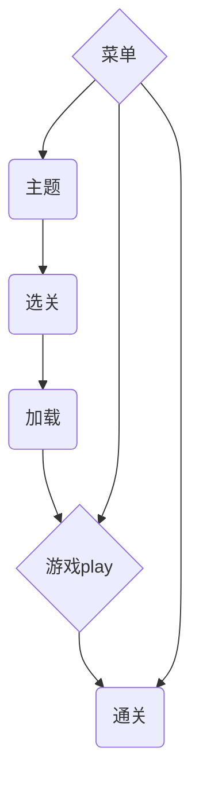

# 5.3试着增加状态

## 5.3.1状态迁移流程

`主题`

- 游戏启动后立即进入该状态,按下按钮后跳转到选关,暂时使用空格来激活

`选关`

- 输入1-9后游戏保存该值然后跳转到加载状态

`加载`

- 虽然游戏很小没什么东西可以加载但是这个东西在市面上的大部分游戏都存在,是不可忽视的部分
- 加载很快但是我们需要让他停留一秒

`游戏`

- 运行游戏.按下空格键游戏迁移到菜单画,通关后迁移到通关画面

`菜单`

- 游戏菜单提供`重置` `选关` `回到主页面` `继续`四个选项,准备好图片覆盖在游戏画面上,这里我们把alpha值设置为0.5
- 点击重置后回到最初状态
- 点击选关后前往选关画面
- 点击回到主题后放弃游戏
- 点击继续直接返回游戏页面

`通关画面`

- 

## 流程图



使用了switch来管理状态

```C++
    void Framework::update()
	{
		//debugCoutStatus();
		setFrameRate(60);
		//if (rateCount % 60 == 0)
		//{
		//	cout << frameRate() << endl;
		//}

		switch (gStatus)
		{
		case GameLib::gameStatus::RUNNING:
			mainLoop();
			if (isKeyTriggered(' '))
			{
				gStatus = GameLib::gameStatus::STOP;
			}
			break;
		case GameLib::gameStatus::STOP:
			showTitle();
			if (isKeyTriggered(' '))
			{
				titleRead = 0;
				gStatus = GameLib::gameStatus::RUNNING;

			}
			break;
		case GameLib::gameStatus::MENU:
			break;

		}
	}
	void mainLoop()
	{
		// 创建游戏场景
		switch (gStateStatus)
		{
		case GameLib::stateStatus::INIT:
			gStateStatus = GameLib::stateStatus::READY;
			gState = new State("stageData.txt"); // 关卡文件读取
			break;
		case GameLib::stateStatus::READY:
			gState->draw();
			if (GameLib::Framework::instance().isKeyOn('w'))
			{
				gState->move('w');
			}
			else if (GameLib::Framework::instance().isKeyOn('s'))
			{
				gState->move('s');
			}
			else if (GameLib::Framework::instance().isKeyOn('a'))
			{
				gState->move('a');
			}
			else if (GameLib::Framework::instance().isKeyOn('d'))
			{
				gState->move('d');
			}
			if (gState->gameOver())
			{
				gStateStatus = GameLib::stateStatus::CLEAR;
			}
			break;
		case GameLib::stateStatus::CLEAR:
			SAFE_DELETE(gState);
			GameLib::Framework::instance().requestEnd();
			break;
		}
	}
```
