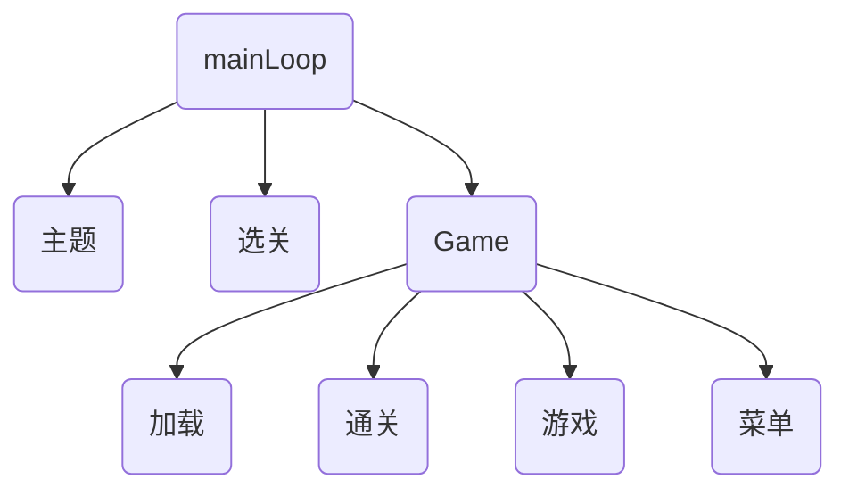

# 5.4 代码审查

## 5.4.1 与素材的加载、释放相关的问题

在5.3的代码中我使用了switch并在mainloop中实现管理，似乎作者一定清楚我们这些初学者的情况，对对象管理理解不够深做法也不会使用老道的管理手段，在我的代码中没有做到书中说的必要时才新建，不用时销毁在5.4中需要尝试着去实现一下

书中提示到: `把各个状态设计为类，在构造函数中通过new生成自己需要的对象，在析构函数中delete之前通过new生成的东西`

## 5.4.2 多状态共用素材的问题

设计思路

- 菜单会叠加在游戏画面上显示
- 菜单选择完成后返回到原先的画面
- 菜单和游戏状态都会包含State，当离开游戏或者处于菜单状态时不允许调用State的析构函数
- 将State指针传递给迁移目标状态设计过于复杂，会忘记执行delete尽量遵守`谁生成谁释放`的原则
- 如果把State作为全局变量，那么就会违背`必要时才创建，无用就释放`的原则
  
结论：将状态类按层次结构进行组织

## 5.4.3 层次结构的状态迁移

## 5.4.4 迁移触发器的放置位置
