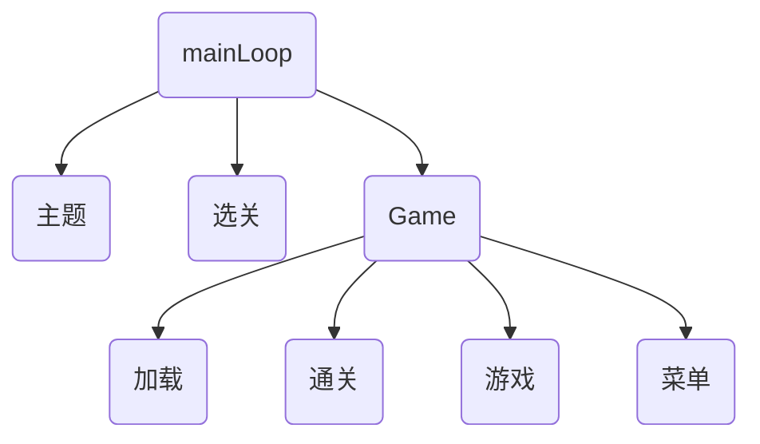

# 5.4 代码审查

## 5.4.1 与素材的加载、释放相关的问题

在5.3的代码中我使用了switch并在mainloop中实现管理，似乎作者一定清楚我们这些初学者的情况，对对象管理理解不够深做法也不会使用老道的管理手段，在我的代码中没有做到书中说的必要时才新建，不用时销毁在5.4中需要尝试着去实现一下

书中提示到: `把各个状态设计为类，在构造函数中通过new生成自己需要的对象，在析构函数中delete之前通过new生成的东西`

## 5.4.2 多状态共用素材的问题

设计思路

- 菜单会叠加在游戏画面上显示
- 菜单选择完成后返回到原先的画面
- 菜单和游戏状态都会包含State，当离开游戏或者处于菜单状态时不允许调用State的析构函数
- 将State指针传递给迁移目标状态设计过于复杂，会忘记执行delete尽量遵守`谁生成谁释放`的原则
- 如果把State作为全局变量，那么就会违背`必要时才创建，无用就释放`的原则
  
结论：将状态类按层次结构进行组织

## 5.4.3 层次结构的状态迁移



## 5.4.4 迁移触发器的放置位置

关于按键的循环检测

`老代码`

```C++
if (GameLib::Framework::instance().isKeyOn('w'))
			{
				gState->move('w');
			}
			else if (GameLib::Framework::instance().isKeyOn('s'))
			{
				gState->move('s');
			}
			else if (GameLib::Framework::instance().isKeyOn('a'))
			{
				gState->move('a');
			}
			else if (GameLib::Framework::instance().isKeyOn('d'))
			{
				gState->move('d');
			}
			if (gState->gameOver())
			{
				gStateStatus = GameLib::stateStatus::CLEAR;
			}
```

`新代码`

```C++
    char keyPut[] = { 'w','s','a','d','q'};
			char keyIn = ' ';
			for (int i = 0; i < 5; i++)
			{	// 按键循环监听
				if (GameLib::Framework::instance().isKeyOn(keyPut[i])) {
					keyIn = keyPut[i];
				};
			}
			if (keyIn != ' ')
			{
				//过滤是否为q  返回到标题
				if (keyIn=='q')
				{
					frame->setNextStatus(StatusFrame::StatusType::SEQ_STAGE_SELECT);
				}
				mState->move(keyIn);
			}
```
使用类去管理类的创建和销毁

```C++
	void StatusFrame::update()
	{
		if (mTitle)
		{
			mTitle->update(this);
		}
		else if (mStage)
		{
			mStage->update(this);
		}
		else if (mGame)
		{
			mGame->update(this);
		}
		// 状态迁移
		switch (mNextStatus)
		{
		case Sequence::StatusFrame::StatusType::SEQ_STAGE_SELECT:
			GameLib::cout << "选关" << GameLib::endl;
			SAFE_DELETE(mTitle);
			SAFE_DELETE(mGame);
			mStage = new StageSelect();
			break;
		case Sequence::StatusFrame::StatusType::SEQ_TITLE:
			GameLib::cout << "标题" << GameLib::endl;
			SAFE_DELETE(mStage);
			SAFE_DELETE(mGame);
			mTitle = new Title();
			break;
		case Sequence::StatusFrame::StatusType::SEQ_GAME:
			GameLib::cout << "游戏" << GameLib::endl;
			SAFE_DELETE(mTitle);
			SAFE_DELETE(mStage);
			mGame = new StatusFrameGame(this);
			break;
		case Sequence::StatusFrame::StatusType::SEQ_NONE:
			break;
		}
		mNextStatus = StatusType::SEQ_NONE;
	}

```

子类的状态传递传入父对象this子类对父类进行设置
